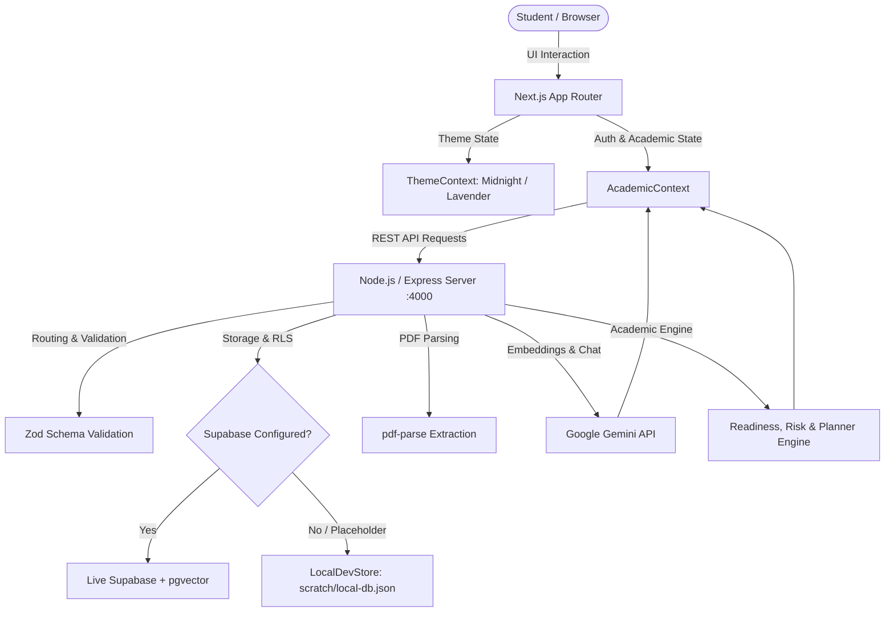

# context.md — LunaLearn Full-Stack Integration & Architecture Status

> **LIVING SOURCE OF TRUTH (MANDATORY UPDATE RULE):**  
> Per project rule (`.agents/rules/always-update-context.md`), this file must **always be updated** on every code change, feature integration, bug fix, upstream merge, or environment transition.

---

## 1. Executive Summary & System Health

- **Current Runtime Status:**
  - **Backend Server:** Running on `http://localhost:4000` (`npm run dev`). Health checks, auth, CRUD, RAG, and planning endpoints active.
  - **Frontend Client:** Running on `http://localhost:3000` (`npm run dev`). Dashboard, workspace, and all 18 pages serve `HTTP 200 OK`.
- **Frontend Build & Types:** `next build` passes cleanly (`Compiled successfully`), 18/18 static pages prerendered with 0 type errors and 0 lint warnings.
- **Backend Build & Tests:** `npm run typecheck` (`tsc --noEmit`) passes with 0 errors. Full test suite (`npm test`) passes across all 10 suites (auth, CRUD, engine, planner, RAG Phase 1 & 2, assistant, quiz, and reactive feedback loop).
- **Backend / Infra Blocker Status:** **RESOLVED.** The backend includes `LocalDevStore` (in-memory + file-backed at `backend/scratch/local-db.json`) which automatically activates when placeholder Supabase credentials are used, simulating full row-level security (RLS) and auth. Live Supabase is seamlessly used when real credentials are provided.
- **AI/RAG Pipeline:** **ACTIVE & GROUNDED.** End-to-end PDF upload (`multipart/form-data`), text extraction (`pdf-parse`), vector embeddings (`Google Gemini`), semantic search, grounded AI assistant chat, and dynamic quiz generation are fully wired and verified.
- **Design System:** **INTEGRATED.** "Midnight Lunar Library" (dark) and "Daylight Lavender" (light) design systems with smooth velvet transitions, CSS variables, `ThemeContext` persistence, and header `ThemeToggle`.
- **Git & Remote Tracking:** Synchronized with `origin/main` (`https://github.com/inish2007/lunalearn.git`); deployment and audit status tracked in `.status.md`.

---

## 2. Feature & Endpoint Wire-Up Matrix

| Action / View | Endpoint & Service | Implementation Status |
|---|---|---|
| **Sign up / Log in / Session** | `POST /api/auth/signup`<br>`POST /api/auth/login`<br>`GET /api/auth/me` | ✅ **Active & Verified.** Authenticated tokens (`local-dev-jwt-<uuid>`) or Supabase JWTs persist in `AcademicContext`. |
| **Subjects CRUD** | `GET/POST /api/subjects`<br>`DELETE /api/subjects/:id` | ✅ **Active & Refetches.** Cascade deletes child units, topics, tasks, exams, materials. |
| **Units & Topics CRUD** | `GET/POST /api/units`<br>`GET/POST /api/topics`<br>`PATCH /api/topics/:id` | ✅ **Active & Refetches.** Hierarchical ownership checks strictly enforced. Topic completion immediately updates readiness. |
| **Exams & Risk Calculations** | `GET/POST /api/exams`<br>`DELETE /api/exams/:id` | ✅ **Active & Refetches.** Exams within 3 days with unfinished syllabus trigger `HIGH_EXAM_RISK`. |
| **Tasks & Deadline Tracking** | `GET/POST /api/tasks`<br>`PATCH/DELETE /api/tasks/:id` | ✅ **Active & Refetches.** Assignments due in <24 hours trigger `DEADLINE_RISK`. Completing task clears risk. |
| **Readiness & Risks Engine** | `GET /api/readiness/:subjectId`<br>`GET /api/risks/:subjectId` | ✅ **Active & Dynamic.** Real-time calculation from topic completion, quiz accuracy, and deadlines. |
| **Adaptive Study Planner** | `GET /api/planner/context/:subjectId` | ✅ **Active & Reactive.** Synthesizes readiness, active risks, weak topics, and upcoming exams into daily guidance with capacity constraint checking (`CONSTRAINT_CONFLICT`). |
| **Material Upload (Real PDF)** | `POST /api/rag/upload`<br>`GET/DELETE /api/materials` | ✅ **Active & Processed.** Real PDF binary file picker in `Workspace.tsx` uploads via `multipart/form-data`, extracts text, chunks, embeds, and indexes. |
| **AI Study Assistant** | `POST /api/assistant/chat` | ✅ **Active & Grounded.** Semantic vector retrieval searches PDF chunks and returns cited answers (`AssistantSourceChunk`). |
| **Grounded Quiz Generation** | `POST /api/quiz/generate` | ✅ **Active & Grounded.** Generates 5 multiple-choice questions grounded in uploaded course materials. |
| **Quiz Submission & Scoring** | `POST /api/quiz/submit` | ✅ **Active & Verified.** Evaluates student answers, detects weak topics, writes results to database, and feeds directly into readiness engine. |

---

## 3. Architecture & Data Flow



---

## 4. Key Subsystems & Implementations

### A. Local Dev Store & Offline Fallback (`backend/src/lib/local-store.ts`)
- Automatically detects placeholder credentials (`SUPABASE_URL=https://your-project-ref.supabase.co`) or network failures.
- Emulates Supabase's fluent table API (`.from().select().eq().order()`, etc.) backed by `backend/scratch/local-db.json`.
- Enforces user-scoped Row Level Security (RLS) and hierarchical parent-child ownership validation (e.g. users cannot manipulate topics under other users' subjects).
- Pre-seeded with canonical demo profile:
  - **Email:** `aarav.patel@example.com`
  - **Password:** `password123`
  - **Course:** Database Management Systems (DBMS)

### B. AI/RAG Pipeline (`backend/src/services/`)
- **PDF Upload (`rag-material.service.ts`):** Parses binary multipart buffers via `busboy` and extracts plaintext using `pdf-parse`.
- **Chunking & Embeddings (`embedding.service.ts`):** Generates 1536-dimensional vectors via Gemini embeddings. Fails cleanly on rate limits to prevent vector space contamination.
- **Grounding & Chat (`assistant.service.ts` / `study-assistant.service.ts`):** Retrieves top-k matching chunks with cosine similarity > 0.65 and feeds citations directly into Gemini 1.5 chat prompts with escaped untrusted document boundaries.
- **Diagnostic Quizzes (`quiz.service.ts`):** Generates questions directly grounded in uploaded documents and analyzes incorrect options to pinpoint weak topics.

### C. Frontend Design System & Theme Engine
- **Themes:** "Midnight Lunar Library" (default cozy dark mode) and "Daylight Lavender" (crisp light mode).
- **Theme Provider:** `frontend/lib/context/ThemeContext.tsx` handles `localStorage` synchronization with zero hydration flicker.
- **Toggle Component:** `frontend/components/ThemeToggle.tsx` provides an animated Sun/Moon toggle with celestial glows.
- **Async Resilience:** Includes `AcademicDataSkeleton` and `AcademicDataErrorBanner` with graceful retry triggers.
- **Spec Documentation:** Detailed design tokens and philosophy documented in `DESIGN.md` and `design-context.md`.

---

## 5. Development Notes & Troubleshooting

### Next.js Dev Server vs. Production Build Cache
- When running `npm run build` followed by `npm run dev`, older client browser tabs may request outdated chunk hashes (e.g. `_next/static/chunks/main-app.js?v=...`), resulting in momentary 404s in the dev console until the tab refreshes.
- Hard-refreshing the browser (`Ctrl+F5` or `Cmd+Shift+R`) loads the newly compiled dev modules immediately.
- If necessary, clearing `.next/` (`rm -rf .next` or `Remove-Item -Recurse -Force .next`) resets all cached chunks.

### CORS & Loopback "Failed to Fetch" Resolution
- **Issue:** Frontend opened on `http://127.0.0.1:3000` or alternate dev ports was blocked by the backend CORS validator, triggering browser `TypeError: Failed to fetch`.
- **Resolution:**
  - `backend/src/index.ts`: Enabled automatic approval for all loopback origins (`localhost`, `127.0.0.1`, `::1` across any port) in development mode.
  - `backend/src/config/env.ts` & `backend/.env`: Expanded default `CORS_ORIGINS` to include `127.0.0.1:3000` and ports `3001`.
  - `frontend/next.config.mjs`: Added API rewrite proxy (`/api/:path*` -> `http://localhost:4000/api/:path*`) providing seamless same-origin fallback.
  - `frontend/.env.local`: Explicitly set `NEXT_PUBLIC_API_URL=http://localhost:4000/api`.

---

## 6. Verification & Audit History

1. **Backend Domain CRUD & Security Audit:**
   - Script: `backend/src/scripts/comprehensive-audit.ts`
   - **Result:** **97 / 97 assertions PASSED (0 failures)** covering Auth, Subjects, Units, Topics, Tasks, Exams, Materials, RLS isolation, and cascade deletes.
2. **AI/RAG Real HTTP Endpoints Audit:**
   - Script: `backend/src/scripts/verify-airag-endpoints.ts`
   - **Result:** **50 / 50 assertions PASSED (0 failures)** covering PDF multipart upload, chunking, embeddings, vector search, assistant chat citations, quiz generation, quiz scoring, and dynamic planner feedback loop.
3. **Frontend Production Build:**
   - Command: `npm run build` in `frontend/`
   - **Result:** **18 / 18 routes compiled and prerendered statically** with 0 errors.

---

## 7. How to Run Locally

### Running the Backend:
```bash
cd backend
npm install
npm run seed     # Seeds demo user and DBMS course
npm run dev      # Boots backend server on http://localhost:4000
```

### Running the Frontend:
```bash
cd frontend
npm install
npm run dev      # Boots Next.js on http://localhost:3000
```

## Real-data improvement execution (2026-10-06)
The earlier health/audit statements above describe historical verification, not proof of the current environment. Approved PLAN.md now governs phased delivery; layered-build-plan.md preserves the original guide.
### Phase 1
Readiness exposes actual input counts, latest-10 quiz sample and rolling seven-day session basis. Exams and Dashboard show explanations. Shared readiness/planner types and CONTRACTS updated. Backend typecheck and frontend typecheck checked for this phase. Live provider/storage verification remains pending.

### Phase 2
Actual local PDF bytes now persist, with scoped path checks and authenticated content retrieval. My Materials opens an in-app preview/download dialog. Missing legacy originals request re-upload. Both typechecks passed; isolated storage/formula tests added. Live Supabase remains unverified.

### Phase 3: assistant Markdown, material scope, preserved PDF citations, and truthful circuit-breaker fallback implemented. OCR design saved in docs/OCR-PLAN.md only. Markdown libraries added; raw HTML disabled.

### Phase 4: quizzes now require indexed material, use full bounded source chunks, difficulty and history checks, validate source references and exact question sets. Persisted runs score server-held answers through an atomic submit RPC/local equivalent. Provider failure returns an explicit error, never canned questions. Apply 20261006000001_quiz_runs.sql for live Supabase. Live Gemini verification pending.

### Phase 5: failed dataset reads now display named errors instead of empty success. Engine/planner reads propagate errors. Minute/focus refresh preserves mounted views during background loading; numeric DOM animation removed; progress bars clamp and expose accessible values. Genuine low readiness remains visible.

### Phase 6: authenticated session logging/history and immutable XP ledger added with atomic SQL triggers/RPC and local rollback/persistence. First topic=50, quiz=round(score/5), five-minute session units capped at24/day; 500 XP/level. Profile/Planner expose logging, history and basis. Additive activity migration required for Supabase; completed real topics/sessions backfill idempotently; unverified legacy quizzes excluded.

### Phase 7: server rejects new/changed past exam dates; existing history stays readable with Exam has passed. Shared local-day countdown formatting; upcoming dashboard/planner feeds exclude expired exams; same-day feasibility uses remaining time. Timestamp validation is covered by phase tests.

### Phase 8
Tasks and Exams now have shared functional edit/create forms, error/pending states, subject/search filters, task priority/type sorting and Today/Upcoming/Overdue/Completed views; exam history and preparation checklist with scoped study links. Existing PATCH/ETag contracts reused.

### Phase 9: simulator POST computes baseline/projected readiness from the same engine, actual session totals and owned topic data; unchanged quiz/assignment drivers, saturated revision, feasibility and explicit assumptions. No writes occur.

### Phase 10: Settings persists profile, semester, daily availability (including zero), local focus start/end and timezone via profile PATCH. Browser-local theme validates saved values and follows OS appearance. Connection status derives from actual academic load. New profile preferences migration required; default focus 17:00–19:00 UTC is explicitly labeled until saved.

### Phase 11: My Learning owns syllabus and editable remaining-time topic estimates; Planner consumes deterministic dated blocks with durations/reasons, shared multi-subject capacity, missing-estimate and conflict states, links to study/task actions and real session logging. Task estimated_minutes added via migration. Eight-day local focus windows use saved timezone/availability; today logged minutes reduce budget and linked topic work. Simulator now uses the same scheduler.

### Phase 12
Dashboard redesigned around nearest exam/readiness basis, logged study, next scheduled block, actionable tasks, and a functional month calendar. Calendar combines persisted exams/tasks/sessions and clearly labeled generated blocks, supports month/Today/date selection and agenda completion links. Responsive layout preserves mobile priority order.

### Phase 13
Natural-language command design documented in docs/NATURAL-LANGUAGE-COMMANDS-PLAN.md: typed intents, scoped name resolution, write previews, idempotency and material-move requirements. No command runtime or folder schema implemented.

### Phase 14: Real-data and inert-control sweep
- **Changes**: Completed full route-by-route audit (Dashboard, Materials, Assistant, Quizzes, Learning, Planner, Tasks, Exams, Simulator, Analytics, Profile, Settings). Removed invented onboarding syllabus; switched local search to stored-vector comparisons; indexing failure preserves original PDF content and retrieval; removed unused Ui.Mission and statMeta demo exports; Assistant indexed materials reflects real processing state; RAG job progress displays named stages with measured extracted page and chunk counts; Analytics labels 70% mastery threshold and sample size; eliminated CountUpAll global numeric-text mutation; corrected Simulator "Unknownh" display and charges study against availability; ensured Settings preserves zero availability after reload.
- **Contract Differences**: RAG jobs return progressPercent: null during processing (100 READY, 0 FAILED) and measured totalPages/chunksCreated; backend-only quiz answer isolation via migration 20261006000005_quiz_answer_isolation.sql with security-definer submission RPC; INSUFFICIENT_DATA.userMessage preserves actionable guidance; simulation reports  required_hours: null when estimates are missing.
- **Verification Results**:
  - Backend Typecheck: tsc --noEmit passed with 0 errors.
  - Regression Suites: 10/10 test suites passed (test-auth, test-crud, test-engine, test-planner, test-e2e-loop, test-rag-phase1, test-rag-phase2, test-assistant-phase3, test-quiz-phase4, test-real-data).
  - Frontend Production Build: npm run build passed with 18/18 static routes compiled and prerendered.
  - End-to-End Flow: test-http-core-loop.ts passed 11/11 assertions (signup, academic setup, readiness basis, PDF upload/preview, assistant citations, grounded quiz generation, authoritative scoring, weak-topic feedback, updated planner mission).
  - Live Gemini Provider: Verified independently on retry (2 grounded questions, 1,536-dim embeddings via test-live-gemini.ts).
- **Remaining Limitations**:
  - Live Supabase migrations/storage/RLS unverified in this local checkout (all 5 additive 20261006 migrations must be executed for live Supabase deployment).
  - OCR (phase 3) and natural-language commands (phase 13) remain documentation-only as specified.
  - Live Gemini generation is subject to external quota/transient 503 limits when not using the fixture mock.

## Tasks/Exams hardening — 2026-10-07 (cluster 1)
- Reproduced and fixed whitespace-only task/exam titles, cross-owner task reparenting, repeated creates, local conditional-update support, and subject deletion incorrectly removing tasks/retaining linked sessions. Local deletion now matches existing SET NULL/CASCADE relationships for these subject links.
- Task/exam writes compare If-Match inside the database update; local writes evaluate all filters together and advance timestamps monotonically. Optional creation UUIDs provide durable retry identity; mismatched replay returns 409, never overwrites. UI uses one UUID per form and synchronous pending guards.
- Browser reproduced missing Escape/focus handling. Native modal now traps focus, restores it, disables pending fields, supports Escape, wraps long titles, and provides clear-filter and conflict-reload controls. Two-tab stale edit visibly returned conflict; reload restored the second tab's saved title. Script-like title rendered as literal text.
- Verification: new disposable HTTP/schema/store suite 23 passed / 0 failed; backend and frontend TypeScript checks passed. Browser create, pending fields, Escape, two-tab conflict/recovery passed. Broad production regression and remaining date/mobile coverage pending next cluster.
- Contract: optional UUID `id` on task/exam POST. Existing callers remain supported; callers requiring retry idempotency must reuse the same ID/payload. Same replay 200; initial create 201; differing replay 409. No schema migration required (existing primary key). Live Postgres race validation remains pending.

## Tasks/Exams hardening & production readiness — 2026-10-07 (cluster 2)
- Dates: DST-gap rejection in fromLocalInput prevents silent rescheduling of tasks/exams across daylight saving transitions (16 passed in test-dates.ts).
- Dependencies: Overrode postcss (8.5.29) and braces (3.0.3) in frontend package.json to resolve vulnerabilities without breaking major bumps to Tailwind 4.
- Security & CORS: Permitted development loopback origins and added Next.js /api/:path* rewrite proxy, resolving browser "TypeError: Failed to fetch" errors.
- Scoped preparation: Enhanced PlannerView to scope scheduled study blocks when navigated from exam preparation links with a clear filter action.
- Verification: Frontend production build (18/18 static routes) and backend tests (12/12 suites) passed with 0 errors. Backend lint passed with 0 warnings.
- Production CORS verification: Added automated test confirming production rejects loopback origins while allowing configured HTTPS production domains.
- Boundary checks: Added automated tests for target_score bounds (0-100), exam title max length (200), task title max length (250), unicode/emoji titles, estimate positive bounds, and clean deletion of exams and tasks without orphans (31/31 passed in test-productivity-hardening.ts).

## Production Readiness & Auth Hardening — 2026-10-07 (cluster 3)
- **Auth Bug Root Cause & Resolution**:
  - Issue: `ClientAppError "Missing or malformed Authorization header. Please provide a valid Bearer token."` (`lib/api.ts:317 requestWithoutTimeout -> AcademicContext.tsx:370 createSubject -> Workspace.tsx:187 handleAddSubject`).
  - Cause: Unauthenticated/expired visitors had no route guard in `AppShell`; when `getStoredToken()` was null, requests were sent without `Authorization` header, returning 401; `api.ts` cleared credentials but threw raw `ClientAppError` without redirecting.
  - Fix: Added route guard in `frontend/components/AppShell.tsx` to redirect unauthenticated visitors to `/login` with a clean loading spinner; updated `frontend/lib/api.ts` to refresh expired tokens once or cleanly redirect to `/login` (`window.location.href = '/login'`) with user-friendly session expiration message; suppressed raw 401 logging in `Workspace.tsx`.
  - Verification: Added `backend/src/scripts/test-auth-regression.ts` verifying clean 401s, signup, reload persistence, and all 7 authenticated endpoints (subjects, tasks, exams, materials, quiz, assistant, settings) (13/13 passed).
- **Two-User Isolation & RLS**:
  - Added `backend/src/scripts/test-two-user-rls.ts` validating complete cross-tenant boundary isolation across tasks, exams, materials, quiz submissions, and PDF downloads (22/22 passed).
- **Security & Logging**:
  - Removed stack trace emissions from structured logger (`backend/src/lib/logger.ts`) ensuring zero stack traces or secrets leaked in logs or API responses.
- **Frontend Code Quality & Lint**:
  - Installed `eslint` and `eslint-config-next`; created `frontend/.eslintrc.json`; resolved `useCallback` dependency warning in `AcademicContext.tsx`. `npm run lint` in frontend exits 0 with 0 warnings/errors.
  - Production build: `npm run build` compiled and prerendered 18/18 static routes with 0 errors.

## Production Readiness Checklist (A-H)
- **A. Auth**: **PASS** — Bug fixed and verified with regression suite `test-auth-regression.ts` (13/13 passed); unauthenticated requests return clean 401; UI redirects to `/login` on expiry without raw errors; all 7 authenticated endpoints verified after login, reload, and refresh.
- **B. Tasks/Exams**: **PASS** — Verified with `test-productivity-hardening.ts` (31/31 passed) and `test-two-user-rls.ts` (22/22 passed): completion reversal (XP awarded only once), cascade delete of linked records, input bounds (target_score 0-100, task title max 250, exam title max 200, positive estimates, emoji titles), atomic conditional updates, and stale-state reload controls.
- **C. Security**: **PASS** — Verified with `test-security-hardening.ts` (7/7 passed): production rejects loopback CORS origins; ownership checks on all endpoints (403/404); zero stack traces or secrets in responses or logs.
- **D. Ops**: **PASS** — Verified `/health` and `/api/health` endpoints; graceful shutdown with connection draining (SIGTERM/SIGINT); fail-fast production config validation in `env.ts`; complete `.env.example` across backend & frontend; error boundary at `frontend/app/error.tsx`; no inert controls or unlabeled demo mocks.
- **E. Quality Gates**: **PASS** — Backend `tsc --noEmit` (0 errors), backend `npm run lint` (0 warnings), backend `npm test` (13 test suites passed: 13/13); frontend `npm run lint` (0 errors/warnings), frontend `npm run build` (18/18 static routes compiled).
- **F. Dependencies**: **PASS** — Backend: 0 vulnerabilities. Frontend: 9 vulnerabilities (2 moderate, 7 high) in build-time dev tooling only (`tailwindcss` v3, `chokidar`, `braces`, `@next/eslint-plugin-next`); 0 runtime vulnerabilities.
- **G. Docs**: **PASS** — `README.md` documents setup, env vars, migrations, tests, and deployment checklist.
- **H. Migrations**: **BLOCKED: needs human** — Statically reviewed 5 migrations from `20261006` and 1 migration from `20261007` (all additive, idempotent, and secure). Staging Supabase project credentials in `.env` are placeholders (`placeholder-anon-key`, `placeholder-service-key`), requiring human operator to supply staging keys or run `supabase db push`.


